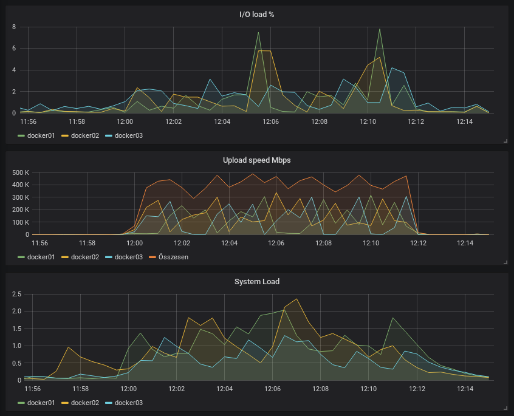

# sysinfo_influxdb
Periodically send system information into influxdb

Inspired by https://github.com/novaquark/sysinfo_influxdb with the following differences:

* Uses python3 + psutil, so it also works under Windows

Installation
============

This is a simple script that is packaged into a single python file. It is designed this way to allow quick and dirty
installation on any machine that has python3 installed, with minimal dependencies. Only external dependencies are
psutil and influxdb. If you prefer to use virtual environments, a pipfile is also provided.

Quick and dirty installation on Debian based systems
----------------------------------------------------

Make sure that you have python 3 installed. This program won't work with python 2.

    sudo apt-get install python3-dev
    sudo apt-get install python3-pip
    sudo python3 -m pip install --upgrade pip
    sudo pip3 install psutil influxdb
    wget https://raw.githubusercontent.com/nagylzs/pysysinfo_influxdb/master/scripts/send_sysinfo_influx.py

Then you are ready to go with "python3 send_sysinfo_influx.py".

Installation on Windows
-----------------------

Basically, yo need to take the same steps:

* Install Python3
* Install psutil and influxdb with pip
* Download the script (or clone the repo) and you are ready to go

Known problems
==============

Some metrics (e.g. cpu/load) may not be available on certain systems. Especially inside virtual machine guests and
docker containers, some files under /procinfo may not be readable. CPU load is known to be unreliable inside
LXC containers.

Planned features
================

* Create a Win32 service so it can be installed on Windows hosts as a service
* Add command line options to write pid files
* Create rc scripts for various systems

Usage
=====

In all cases, please consult the manual of your own copy. This readme
may be out of date.

    python3 scripts/send_sysinfo_influx.py --help
    usage: send_sysinfo_influx.py [-h] [-v] [--silent] [--debug] [-n]
                                  [--host HOST] [-p PORT] [-s] [--insecure]
                                  [-d DATABASE] [--create-database] [-u USER]
                                  [--password PASSWORD] [-a] [-e EXTRA_TAGS]
                                  [-l LOOP] [-i]

    Collect and send system information to an influxdb database.

    optional arguments:
      -h, --help            show this help message and exit
      -v, --verbose         Be verbose (the default is to be silent)
      --silent              Be silent (do not even print error messages)
      --debug               Print debug messages
      -n, --no-send         Do not actually send data to server. (Useful with
                            --verbose.)
      --host HOST           InfluxDb host
      -p PORT, --port PORT  InfluxDb port
      -s, --ssl             Use HTTPS instead of HTTP.
      --insecure            Do not verify ssl cert (insecure).
      -d DATABASE, --database DATABASE
                            InfluxDb database name, defaults to 'sysinfo'
      --create-database     Try to create database if not exists.
      -u USER, --user USER  InfluxDb username
      --password PASSWORD   InfluxDb password. If you didn't enable
                            authentication, then do not specify this option.
      -a, --ask-password    Ask for InfluxDb password. If you didn't enable
                            authentication, then do not specify this option.
      -e EXTRA_TAGS, --extra-tags EXTRA_TAGS
                            Extra tags to add, defaults to : '{'hostname':
                            'nagy'}'
      -l LOOP, --loop LOOP  Send data in an endless loop, wait the specified
                            number of seconds betweenthe sends. You can break the
                            loop with Ctrl+C or by sending a TERM signal.
      -i, --ignore-errors   Continue the loop even if there is an error.

More notes on --extra tags:

You can specify extra tags with --extra-tags. By default,
it only contains your hostname. Example usage of --extra-tags:

    python3 scripts/send_sysinfo_influx.py --extra-tags '{"your_tag_name":"your_tag_value"}' -n -v

It is a good practice to check your data with "-v -n" before sending them to a live server.
